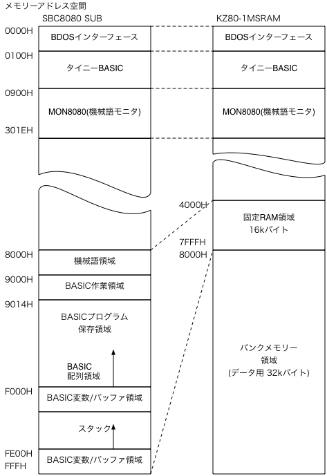

# 機械語モニタ+TinyBASIC　(for KZ80-1MSRAM : 128kBバンクメモリー対応)

## オリジナルソースの所在

- 本ソースは、[SBC8080データパック](http://www.amy.hi-ho.ne.jp/officetetsu/storage/sbc8080_datapack.zip)に同梱されている PTBEXSA.ASM に変更を加えたものです。

## 修正点

- ワーク用メモリー領域を 固定メモリー域アドレス(4000h〜7FFFh)へ変更

```
　　FTOP	EQU	4000H
　　LTOP	EQU	5000H
　　VTOP	EQU	07000H
　　STACK	EQU	07E00H
```
- 機械語モニタのRAM開始アドレスーを変更

```
CC1:
main:
	LXI	H,-484
	DAD	SP
	SPHL
	LXI	H,482
	DAD	SP
	XCHG;;
	LXI	H,16384     <-- 4000hへ変更
	CALL	CCPINT
```

- バンクメモリーをバンク1へ初期セット

```
	ORG	ITOP
ENTRY:
;-- BANK MEM SET
	MVI	A,01H
	OUT	80H
;
```

- おまけ : Z80割り込みモード1で動作させたい場合
  - Z80割り込みモード1(割り込みがあったら強制的にRST 38hを実行)で使用したい場合はコメントアウトを外して再コンパイルしてください。

```
;
;	SYSTEM INITIALIZE
SYSINI:
	LXI	SP,STACK
;	DB	0EDH,056H   <-- コメントアウトを外すと Z80 割り込みモード1で動作します
	MVI	A,11H
```

- 上記修正によりメモリーマップは以下のようになります。




## 使い方

- KZ80-1MSRAMボードで使用する場合は、HEXファイル(PTBEXS1M.HEX)を28C256(EEPROM)へ焼いてご使用ください。
- ソースを修正して再アセンブリしたい場合は、CP/MエミュレーターでMAC.COMを使ってアセンブリしてください。

  - 再アセンブリ例
```
C:\wk>\cpm32_04\cpm MAC PTBEXS1M.ASM
CP/M MACRO ASSEM 2.0
7F04
024H USE FACTOR
END OF ASSEMBLY

C:\wk>\cpm32_04\cpm MAC PTBEXS1M.ASM
```


