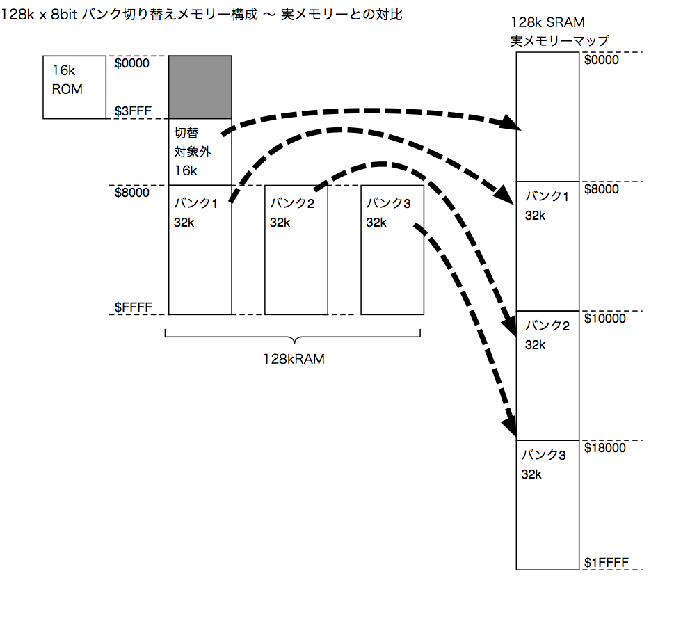

# Z80 128kB メモリーボード (KZ80-1MSRAM)

*※本ボードは基板を試作して確認中です。参考程度にご覧ください。*

## 概要

- SBC8080ルーズキットバスにつながる128kBバンクメモリーボードです。
  - Z80 CPUボード(KZ80-CPUB)にもつながります。
  - ROM領域は16kB(0000h〜3FFFh)です。
  - 固定RAM領域は16kB(4000h〜7FFFh)です。
  - バンクメモリー領域はアドレス8000h〜FFFFhに32kBx3バンクあります。

## 回路図

[回路図はこちら](image/Z80-1MSRAM.pdf)です。

## 部品表

[部品表はこちら](KiCAD/Z80-1MSRAM.ods)です。

※LibreOffice/OpenOfficeのcalcで開ける形式となっています。

## 機械語モニタ+TinyBASICについて

- [SBC8080データパック](http://www.amy.hi-ho.ne.jp/officetetsu/storage/sbc8080_datapack.zip)の機械語モニタ+TinyBASICを使用する場合、使用しているRAM領域(8000h〜FFFFh)をバンク切り替えする仕様となっているためRAMアドレス等を変更する必要があります。
  - [こちら](MON-TB/)にアドレス変更等を対応したソース/ROM焼き用のHEXファイルを添付しました。ご参考まで。

## バンク切り替えの方法について

- メモリーバンクのイメージ図はこちらです。
  - アドレス4000h〜7FFFhの16kBはバンク切り替え対象外RAMとなっています。
    - この領域にスタックやBASIC/機械語モニタなどのワークエリアを設定してください。
  - アドレス8000h〜FFFFhの32kBはバンク切り替え対象RAMとなっています。この領域にスタック、変数域等を設定しているとバンク切り替えのタイミングで暴走する可能性があります。

- バンク切り替えは I/Oアドレス 80hへバンク番号(01〜03)を出力することで切り替えができます。
  - バンク番号00を設定した場合はデフォルトのバンク番号01が設定されます。

## ライセンス

- 本リポジトリのデータは MIT License のもとで公開します。[LICENSE.txt](LICENSE.txt)を参照して下さい。

## 参考リンク

- [SBC8080バスにつながる128kBメモリーボード(1)](https://kuninet.wordpress.com/2018/08/11/sbc8080バスにつながる128kbメモリーボード1/)
- [SBC8080バスにつながる128kBメモリーボード(2)](https://kuninet.wordpress.com/2018/08/12/sbc8080バスにつながる128kbメモリーボード2/)
- [SBC8080バスにつながる128kBメモリーボード(3)](https://kuninet.wordpress.com/2018/08/13/sbc8080バスにつながる128kbメモリーボード3/)
  - 【注意】上記のBLOGの試作記事ではI/Oアドレスを40hにしていますが、当基板では80hへ変更しています。
  
- [KZ80-1MSRAM Rev.1 リリース0.9](https://kuninet.wordpress.com/2018/10/21/kz80-1msram-rev-1-%e3%83%aa%e3%83%aa%e3%83%bc%e3%82%b90-9/)
